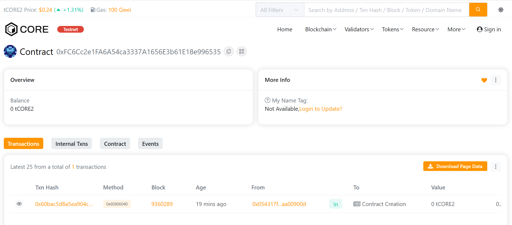

```markdown
# ChainAxis

## Project Description

ChainAxis is a decentralized project management and milestone tracking system built on the Core blockchain. It enables transparent, trustless collaboration between project creators and contributors by managing project budgets and milestone-based payments through smart contracts.

The platform allows project owners to create projects with dedicated budgets, define milestones with specific rewards, assign tasks to contributors, and automatically distribute payments upon milestone completion. All transactions and project activities are recorded on the blockchain, ensuring transparency and accountability.

Built with Hardhat and deployed on Core Testnet 2, ChainAxis leverages blockchain technology to eliminate intermediaries and create a fair, transparent ecosystem for project collaboration.

## Project Vision

Our vision is to revolutionize project management by leveraging blockchain technology to create a trustless, transparent ecosystem where:

- **Project owners** can manage budgets efficiently and ensure work is completed before payment
- **Contributors** receive guaranteed payment upon completing assigned milestones
- **Transparency** is maintained through immutable blockchain records
- **Trust** is established through smart contract automation rather than intermediaries
- **Global collaboration** is enabled without geographical or institutional barriers

ChainAxis aims to become the go-to platform for decentralized project management, particularly for:
- Freelance and remote work
- Open-source project funding
- DAO operations and treasury management
- Cross-organizational collaborations
- Bounty programs and hackathons
- Web3 project development and coordination

## Key Features

### 1. **Decentralized Project Creation**
- Create projects with cryptocurrency-based budgets stored securely in smart contracts
- Define comprehensive project details including name and description
- Track all projects associated with user addresses
- Immutable project records on the Core blockchain

### 2. **Milestone-Based Task Management**
- Break down projects into manageable milestones with specific deliverables
- Assign milestones to specific contributor wallet addresses
- Define reward amounts for each milestone from the project budget
- Track completion status and timestamps for full accountability
- Support multiple milestones per project

### 3. **Automated Payment Distribution**
- Automatic reward transfer upon milestone completion approval
- Smart contract ensures funds are locked and distributed fairly
- No intermediaries or payment processors required
- Instant settlement upon milestone verification by project owner
- Transparent fund flow visible on blockchain

### 4. **Transparency & Accountability**
- All project and milestone data stored on-chain
- Immutable record of project creation, assignments, and completions
- Event emissions for easy tracking and integration with external systems
- Public verification of project budgets and milestone rewards
- Complete audit trail for all transactions

### 5. **Secure Access Control**
- Owner-only functions protected by Solidity modifiers
- Secure fund management with built-in validation checks
- Prevention of double-spending and unauthorized access
- Input validation to prevent common vulnerabilities
- Role-based permissions for project management

### 6. **Core Blockchain Integration**
- Deployed on Core Testnet 2 for testing and development
- Compatible with Core's high-performance blockchain infrastructure
- Low transaction fees for cost-effective project management
- Fast confirmation times for responsive user experience

## Future Scope

### Short-term Enhancements (0-6 months)
- **Dispute Resolution System**: Implement a decentralized voting mechanism for milestone disputes
- **Multi-signature Approval**: Allow multiple approvers for milestone completion verification
- **Project Collaboration**: Enable multiple owners and role-based access control
- **Token Support**: Accept ERC-20 tokens in addition to native CORE tokens
- **Partial Payments**: Support milestone progress-based partial reward releases
- **Project Categories**: Categorization system for better project discovery
- **Frontend DApp**: Build a user-friendly web interface for contract interaction

### Medium-term Development (6-12 months)
- **Reputation System**: Build contributor reputation scores based on completed milestones
- **Project Templates**: Pre-defined milestone structures for common project types
- **Time Tracking Integration**: Connect with time-tracking tools for hourly-based milestones
- **Advanced Escrow**: Implement escrow services with time-locks and conditional releases
- **Analytics Dashboard**: Comprehensive on-chain analytics for project performance
- **Notification System**: Real-time notifications for project updates and milestone completion
- **Mobile App**: Native mobile applications for iOS and Android platforms
- **API Development**: RESTful API for third-party integrations

### Long-term Vision (12+ months)
- **Cross-chain Support**: Deploy on multiple blockchain networks (Ethereum, Polygon, BSC, Arbitrum)
- **DAO Governance**: Enable community governance for platform decisions and upgrades
- **NFT Certificates**: Issue achievement NFTs for completed milestones and projects
- **AI-Powered Matching**: Smart matching between projects and contributors based on skills and history
- **Oracle Integration**: Connect with Chainlink oracles for automated milestone verification
- **Decentralized Storage**: IPFS/Arweave integration for project documentation and deliverables
- **Legal Framework**: Smart legal contracts for formal agreements and compliance
- **Insurance Mechanism**: Community-funded insurance pool for project completion guarantees

### Ecosystem Development
- **Developer SDK**: Comprehensive tools and libraries for easy platform integration
- **Project Marketplace**: Discover projects and find skilled contributors
- **Staking System**: Stake CORE tokens to participate in governance and earn rewards
- **Grant Program**: Fund innovative projects built on ChainAxis
- **Educational Platform**: Tutorials, documentation, and certification programs
- **Partnership Network**: Collaborate with other Web3 platforms and communities
- **Bounty Programs**: Incentivize community contributions to platform development

---

## Installation & Setup

### Prerequisites
- Node.js v16+ and npm/yarn
- MetaMask or compatible Web3 wallet
- CORE tokens for Core Testnet 2 (get from faucet)

### Installation Steps

1. **Clone the repository**
```bash
git clone 
cd ChainAxis
```

2. **Install dependencies**
```bash
npm install
```

3. **Configure environment variables**
```bash
cp .env.example .env
# Edit .env and add your private key
```

4. **Compile contracts**
```bash
npm run compile
```

5. **Deploy to Core Testnet 2**
```bash
npm run deploy
```

---

## Usage Guide

### Deploying the Contract

```bash
# Deploy to Core Testnet 2
npx hardhat run scripts/deploy.js --network coreTestnet2

# Deploy to local Hardhat network for testing
npx hardhat run scripts/deploy.js --network localhost
```

### Interacting with the Contract

```javascript
// Example: Create a project
await project.createProject(
  "Website Redesign",
  "Complete redesign of company website",
  { value: ethers.parseEther("1.0") }
);

// Example: Create a milestone
await project.createMilestone(
  1, // projectId
  "Homepage Design",
  "Design and implement new homepage",
  ethers.parseEther("0.3"),
  "0x..." // assignee address
);

// Example: Complete a milestone
await project.completeMilestone(1); // milestoneId
```

### Running Tests

```bash
npx hardhat test
```

### Local Development

```bash
# Start local Hardhat node
npx hardhat node

# Deploy to local node (in another terminal)
npx hardhat run scripts/deploy.js --network localhost
```

---

## Network Configuration

### Core Testnet 2
- **Network Name**: Core Testnet 2
- **RPC URL**: https://rpc.test2.btcs.network
- **Chain ID**: 1115
- **Currency Symbol**: CORE
- **Block Explorer**: [Core Scan](https://scan.test2.btcs.network)

### Getting Testnet Tokens
Visit the Core Testnet faucet to get test CORE tokens for deployment and testing.

---

## Project Structure

```
ChainAxis/
├── contracts/          # Solidity smart contracts
│   └── Project.sol    # Main project management contract
├── scripts/           # Deployment and utility scripts
│   └── deploy.js     # Deployment script for Core Testnet 2
├── test/             # Contract test files (add your tests here)
├── .env              # Environment variables (not in git)
├── .gitignore        # Git ignore file
├── hardhat.config.js # Hardhat configuration
├── package.json      # Node.js dependencies and scripts
└── README.md         # Project documentation
```

---

## Security Considerations

- Always keep your `.env` file secure and never commit it to version control
- Use a dedicated wallet for deployment with limited funds
- Audit smart contracts before mainnet deployment
- Test thoroughly on testnet before production use
- Implement additional security measures for production environments

---

## Contributing

We welcome contributions! Please follow these steps:

1. Fork the repository
2. Create a feature branch (`git checkout -b feature/AmazingFeature`)
3. Commit your changes (`git commit -m 'Add some AmazingFeature'`)
4. Push to the branch (`git push origin feature/AmazingFeature`)
5. Open a Pull Request

---

## License

This project is licensed under the MIT License - see the LICENSE file for details.

---

## Support & Contact

- **Documentation**: [Link to docs]
- **Discord**: [Community server]
- **Twitter**: [@ChainAxis]
- **Email**: support@chainaxis.io

---

**Built with ❤️ for the decentralized future on Core Blockchain**
```

Address: 0x054317f26cf1974e6e579fbf9358bffdaa00900d





